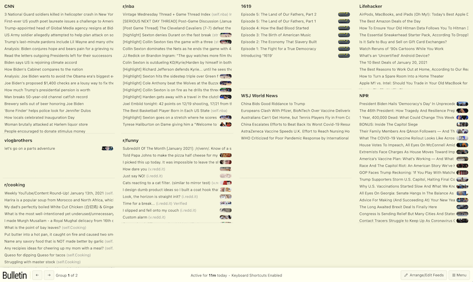
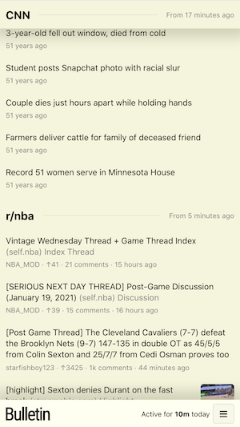

<p align="center"></p>
<p align="center">A minimal, self-hosted newsfeed dashboard, with usage time tracking</p>

#

- Custom sizing and position for each feed in a grid view
- Supports RSS feeds (including YouTube channels via RSS)
- Supports Twitter accounts, subreddits, NewsAPI, Hacker News via API (you'll need get your own API key/secret)
- Tracks time spent active in app, and estimates time spent reading links opened from the app
- Read aloud new feed entries using text-to-speech
- Keyboard shortcuts
- Dark mode

| Desktop                   | Mobile                  |
| :------------------------ | :---------------------- |
|  |  |

## Getting Started

1. Deploy, or set up locally ([see below](#deployment)).
2. Visit the app in the browser and sign up with a new account.
3. If you'd like to prevent future sign ups, set `ALLOW_SIGNUPS=false` in your env/config variables.
4. To add Twitter accounts, subreddits, or NewsAPI feeds, you'll need to add your own API keys/secrets to env/config variables (see [.env.example](../.env.example) for variable names).

## Deployment

### Heroku

Easiest way to deploy (and free, if you choose the free tier) is with Heroku (see [app.json](../app.json) for configuration details):

[](https://heroku.com/deploy?template=https://github.com/kentph/bulletin)

#### Archiving on Heroku when hitting row limits

If you stick with the free tier on Heroku, there's a 10k Postgres row limit (Hobby Dev tier). To get around this, you can trigger an archive from the app menu - this will copy rows from `intervals` and `entry_status` tables as JSON and save as a new row in the `archives` table, then delete the original rows. Later, to export those archive rows, follow these instructions (from <https://jamesbedont.com/export-a-heroku-postgres-table-to-a-csv-file>):

1. Run `heroku pg:psql` to connect to your Heroku Postgres instance.
2. Run `\COPY (SELECT * FROM archives) TO '~/archive.csv' WITH (FORMAT csv, DELIMITER ',', HEADER true);` after archiving to save the archive to csv on your local machine's home directory as `archive.csv`.

### Dokku

If you'd like to choose your own cloud provider, use Dokku instead.

As a quick example, here's how to deploy to Digital Ocean (based on the instructions here <http://dokku.viewdocs.io/dokku/deployment/application-deployment>):

1. Start up a droplet using the Dokku 1-click installer (<https://marketplace.digitalocean.com/apps/dokku>).
2. Make sure to finish configuring your new droplet (visit the server IP in your browser and follow the instructions there, finally clicking Finish Setup).
3. SSH into the droplet (eg. `ssh -i [public key location] root@[droplet IP]`), and run the following commands:

   ```bash
   dokku apps:create bulletin
   sudo dokku plugin:install https://github.com/dokku/dokku-postgres.git
   dokku postgres:create bulletindb
   dokku postgres:link bulletindb bulletin
   dokku config:set bulletin REACT_APP_DB_CLIENT=postgresHeroku JWT_SECRET="[add your secret here]" GENERATE_SOURCEMAP=false ALLOW_SIGNUPS=true TZ=America/New_York
   ```

   What we're doing:

   - Create Dokku app on the droplet.
   - Create Postgres database on the droplet (see <http://dokku.viewdocs.io/dokku/deployment/application-deployment/#create-the-backing-services> if you'd like to use another database service).
   - Link them (defines the `DATABASE_URL` environment variable).
   - Add the remaining required environment variables (these mirror the variables defined as config vars for Heroku).

   If you run into out-of-memory issues while building/deploying, try creating a swapfile (see <https://gist.github.com/henrik/26bb73091712aa42abf2#setup>).

4. On your local machine, where this Git repository is located, define the remote repo to push and deploy to. Replace `droplet IP` and run the following command:

   ```bash
   git remote add dokku dokku@[droplet IP]:bulletin
   ```

5. Deploy using:

   ```
   git push dokku master
   ```

Custom domains and SSL are also supported, but weren't covered in this example. You could also consider creating a new user and disabling root login for security, but again we didn't cover this.

### Run Locally

You can always run the app locally as well. Make sure to:

1. Have Node and npm installed.
2. Add a .env file in the root directory and in /client, following the .env.example files and app.json as guides.
3. To launch the app, run `npm run local` in the root directory. This will install Node modules, produce a production build of the frontend, and then serve it through the Node app. The server will be listening at `localhost:3001`.

## Development

1. Fill in configuration files.
   - Create .env files using .env.example as guides.
     - /client/.env
     - /.env
   - /client/package.json
     - update the "proxy" field with the same address used in .env `LOCAL_URL`, but keep the port number at 3001
2. Make sure Node 12 is installed: `nvm install 12`, `nvm use 12`
3. `npm install` in both /client and root

### Dev watched build

1. Start React server with `npm start` in /client.
2. Start Node server with `npm run dev` in root.
3. Bulletin frontend will be up on port 3000.

### Production client build

1. `npm run build` in root to build client production build.
2. `npm run prod` in root to start server and serve client.
3. Bulletin frontend will be up on port 3001.

## Testing

Appium tests can be run using `npm test` in the root directory.

## License and Attributions

This project is licensed under AGPLv3 (see [LICENSE](../LICENSE)). For attributions, see [licenses-server.csv](/docs/licenses-server.csv) and [licenses-client.csv](/docs/licenses-client.csv).
